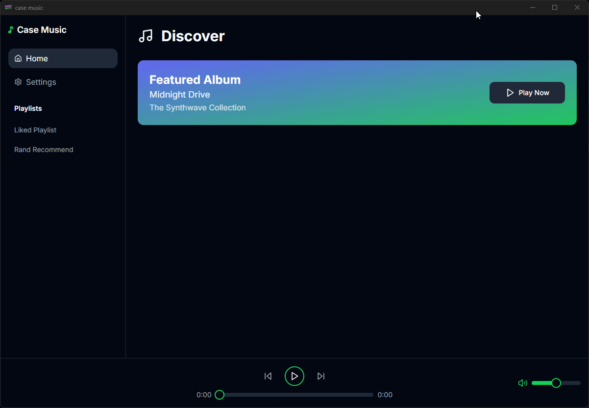
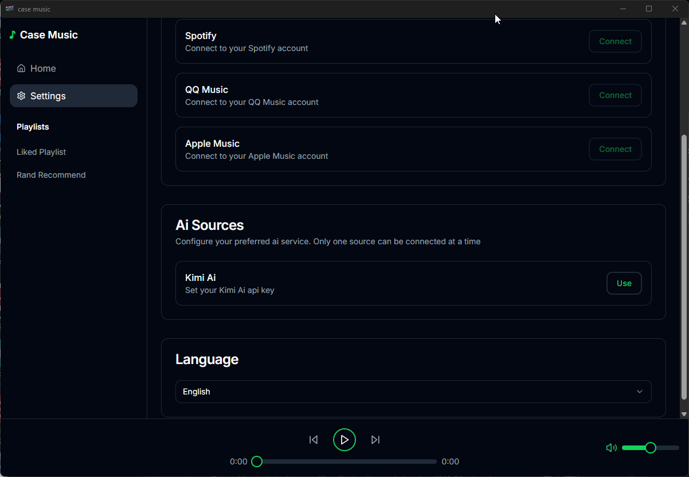
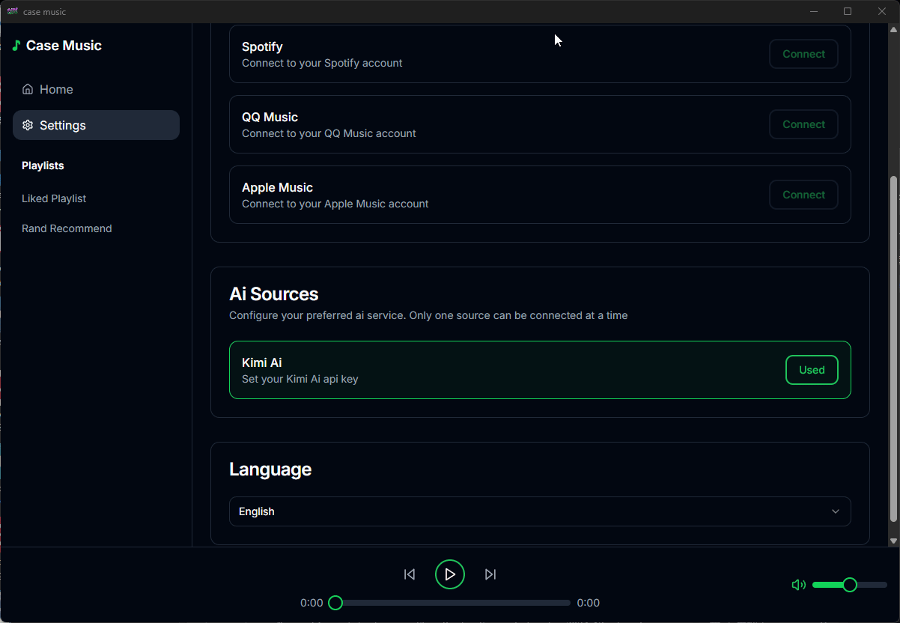
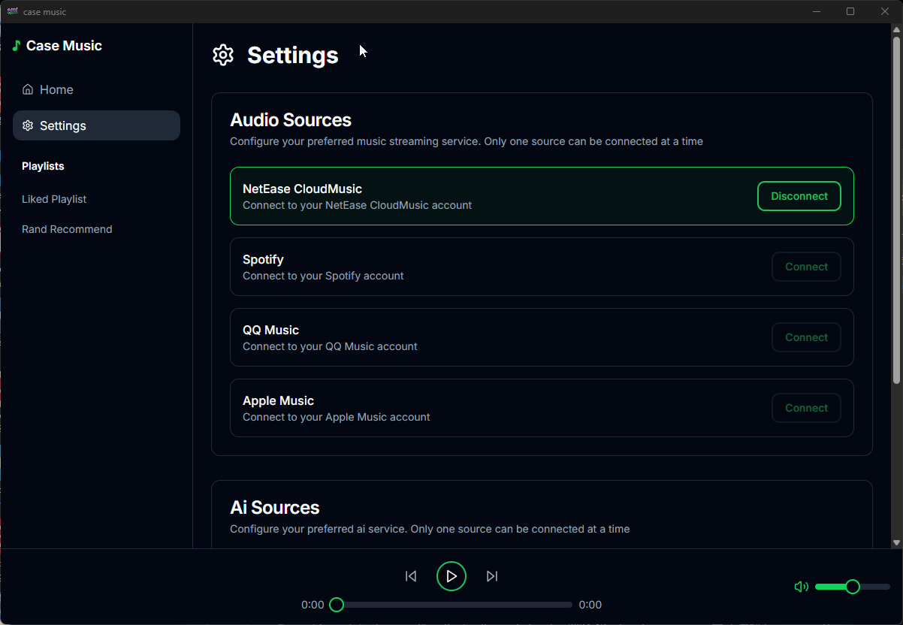
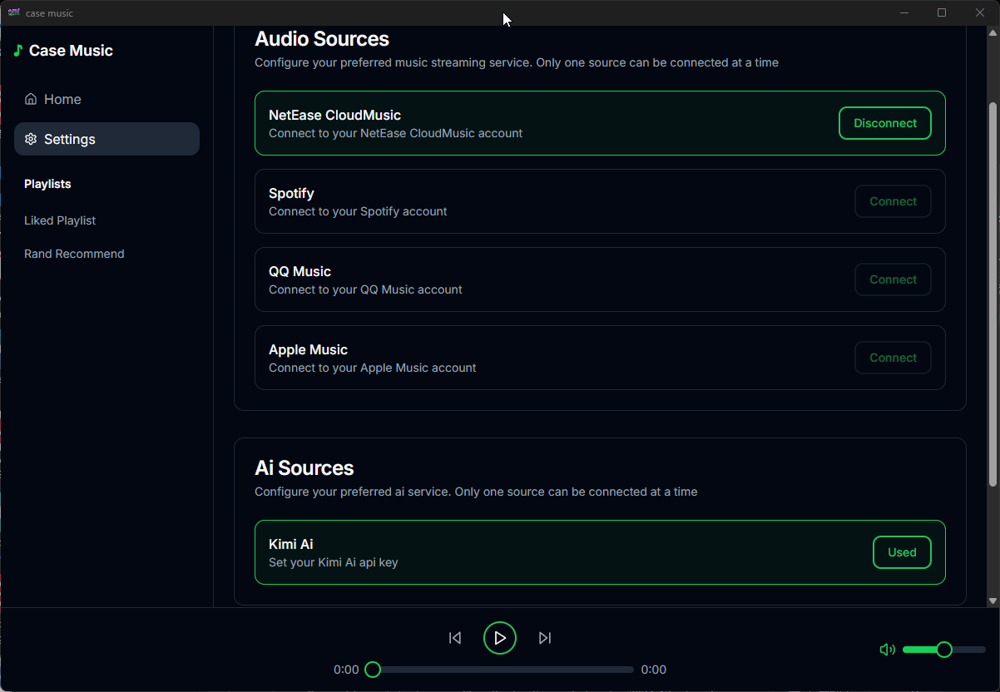
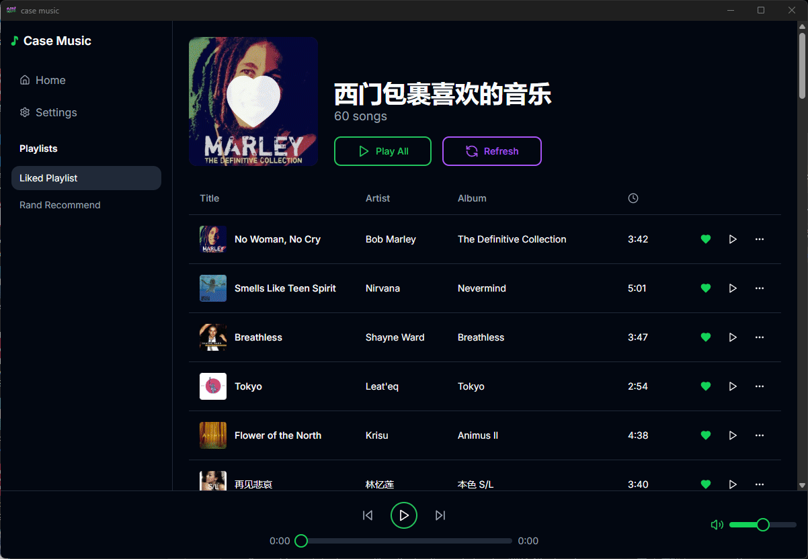
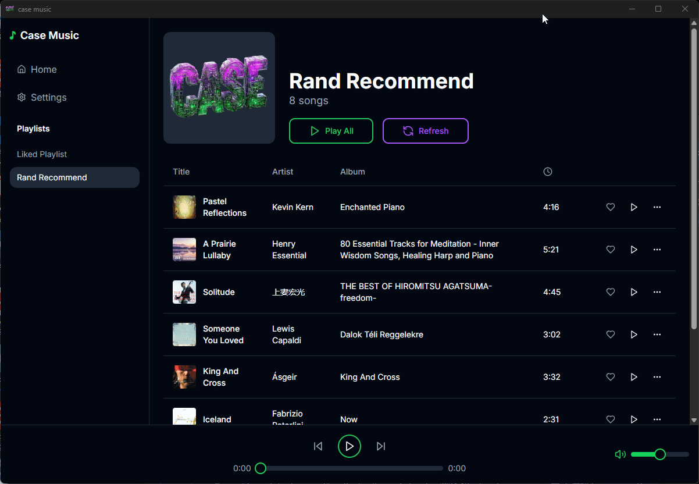
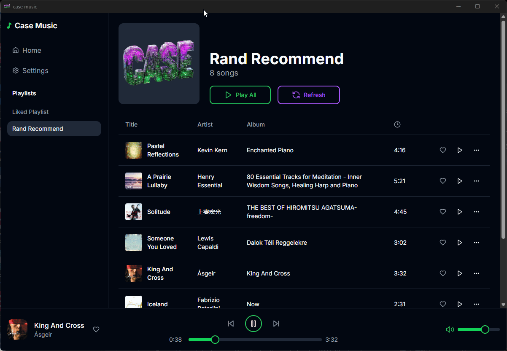
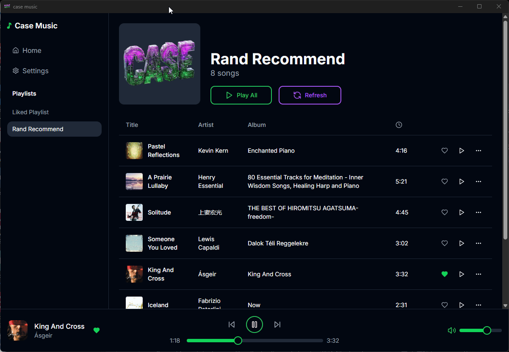

# CASE MUSIC

## Language
- [中文](readmes/zh.md)

## Introduction

# 🎵 Welcome to **CASE MUSIC** 🎧
# 🎬 **CASE MUSIC - AI Music Experience in Action** 🚀

Experience the future of personalized music discovery with **AI-powered recommendations** crafted just for you.

### 🤔 **Have you ever felt this way?**
- **Endless Choices:** Struggling to decide what to listen to every day?
- **Inaccurate Suggestions:** Daily recommendations missing the mark?
- **Limited Options:** Only one recommendation per day isn't enough?
- **Lack of Favorites:** It's been ages since you "hearted" a song?
- **And many more...**

If any of these resonate with you, **CASE MUSIC** is here to transform your music experience.

### 🚀 **Why Choose CASE MUSIC?**
- **Smart AI Recommendations:** Tailored playlists that match your vibe.
- **Continuous Discovery:** Fresh music suggestions, anytime you need.
- **User-Centric Design:** Your preferences drive our playlist engine.

🎧 **Say goodbye to music frustration and hello to effortless discovery.** Try CASE MUSIC today and let the music play!  

### 🎉 Upcoming Features in Version 2.0

- [ ] **Infinite scrolling for Likelist**: Enjoy a smoother experience with seamless scrolling through your favorite tracks.
- [ ] **Multiple playback modes**: Single loop, shuffle, playlist loop—choose the mode that fits your listening style.
- [ ] **Support for QQ Music source**: Access a wider range of music with integrated QQ Music.
- [ ] **More accurate recommendation system**: AI-driven recommendations tailored to your taste.
- [ ] **Support for Apple devices**: Full compatibility with the iOS ecosystem, enabling seamless music enjoyment across devices.

✨ **Stay tuned! Version 2.0 will elevate your music experience to the next level!**

### PC Version

### 🎵 **Music Source Integration**
*Seamlessly link your music sources and unlock endless tracks.*  
  

### 🤖 **AI-Powered Login - Smarter Access**
*Connect seamlessly with AI for a smarter experience.*  

### 🌐 **Multilingual Support**
*Switch languages effortlessly and feel at home.*  

### ⚙️ **Smooth Settings Experience**
*Fine-tune your preferences with ease.*  

### ❤️ **Exploring Your Favorite Tracks**
*Watch how effortlessly you can access your "Liked Songs" list.*  

### 🔀 **Surprise Me - Random Recommendations**
*Feeling adventurous? Let AI surprise you with a random track.*  

### 🎼 **Play Them All - Instant Vibes**
*One click, infinite grooves – Play all your tracks seamlessly.*  

### 🔄 **Refresh & Discover Again**
*New vibes, new moods – Refresh your playlist with a single click.*  
.gif)

### 🎧 **Fall in Love with a Song**
*Heart your favorite tune and make it yours forever.*  

### 💔 **Unfavorite with Ease**
*Changed your mind? Unheart a song effortlessly.*  
  
