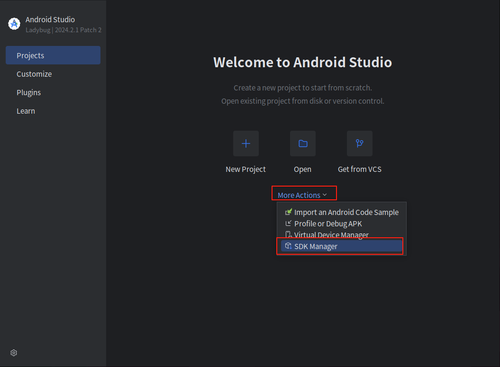
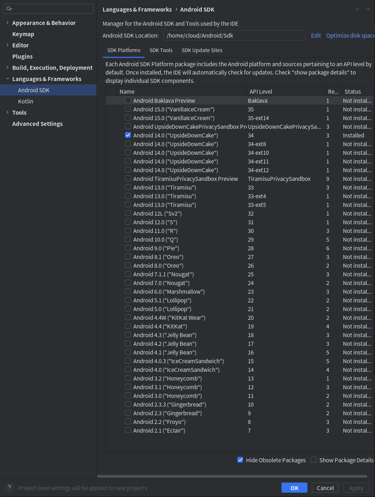
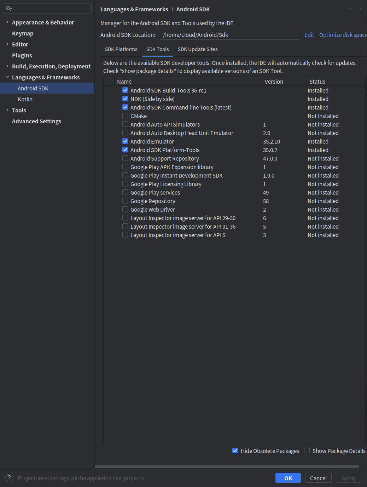

# compile android

## 前置步骤
- 下载`Android Studio`
- 点击`More Action`, 然后点击`SDK Manager`, 如下图

- 勾选如图所示的组件


- 按照[tauri官方文档](https://v2.tauri.app/zh-cn/start/prerequisites/#%E7%A7%BB%E5%8A%A8%E7%AB%AF%E9%85%8D%E7%BD%AE)来做环境配置
- 配置`NDK`的环境变量 `export PATH=$NDK_HOME/toolchains/llvm/prebuilt/linux-x86_64/bin:$PATH`
- 初始化安卓配置`tauri android init`
- 修改配置文件,至于为什么和什么时候解决,关注这个[issue](https://github.com/tauri-apps/tauri/issues/9536)
```jsonc
文件路径: {tauri项目的rust目录路径}/gen/android/buildSrc/src/main/java/com/core/app/kotlin/BuildTask.kt
修改前: val executable = """node""";
修改后: val executable = """cargo-tauri""";
```
- 编译成`.aab`文件,[操作指南](https://v2.tauri.app/zh-cn/distribute/google-play/), 最好去配置一下`Android Studio`的国内镜像源
- 下载[bundletool](https://github.com/google/bundletool/releases),下载`.jar`文件
- 把`.aab`编译成`apks`
  - 安装`openjdk`, 需`>=17`
  - 生成密钥, 指令参考: 
  ```jsonc 
  keytool -genkeypair -v -keystore my-release-key.jks -keyalg RSA -keysize 2048 -validity 10000 -alias my-key-alias
  ```
  - `.aab`转换成`.apks`, 参考指令: 
  ```jsonc
  java -jar bundletool-all-1.17.2.jar build-apks --mode=universal --bundle=/home/cloud/malefooo/fuck-music-app/core/backend/gen/android/app/build/outputs/bundle/universalRelease/app-universal-release.aab --output=fma.apks --ks=./my-release-key.jks --ks-pass=pass:111111 --ks-key-alias=my-key-alias --key-pass=pass:111111
  ```
  - 解压`apks`, 参考指令: 
  ```jsonc
    unzip fma.apks -d fma
  ```