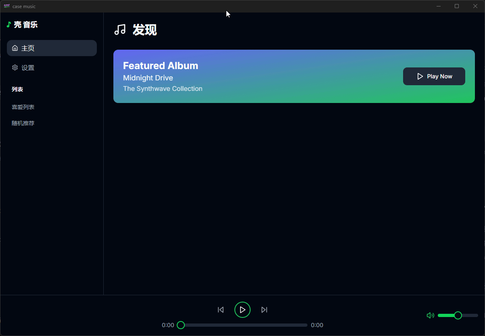
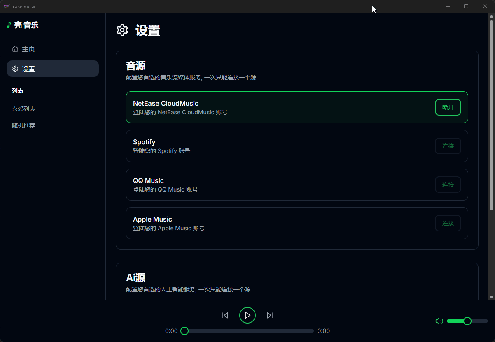
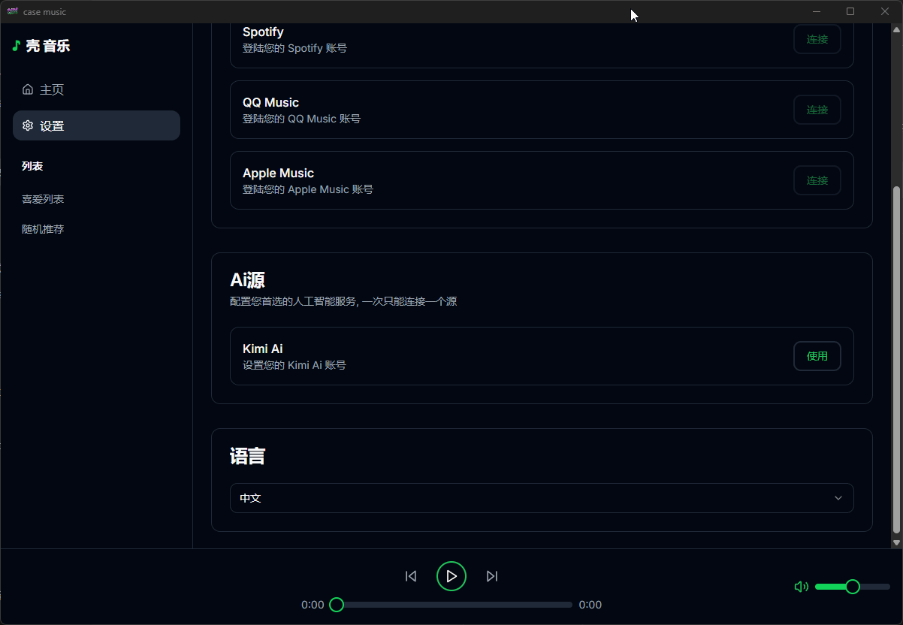
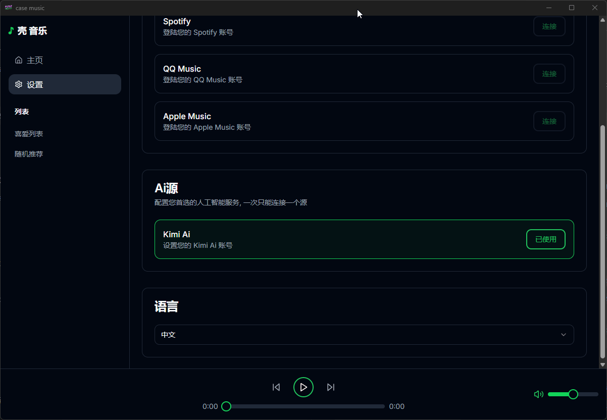
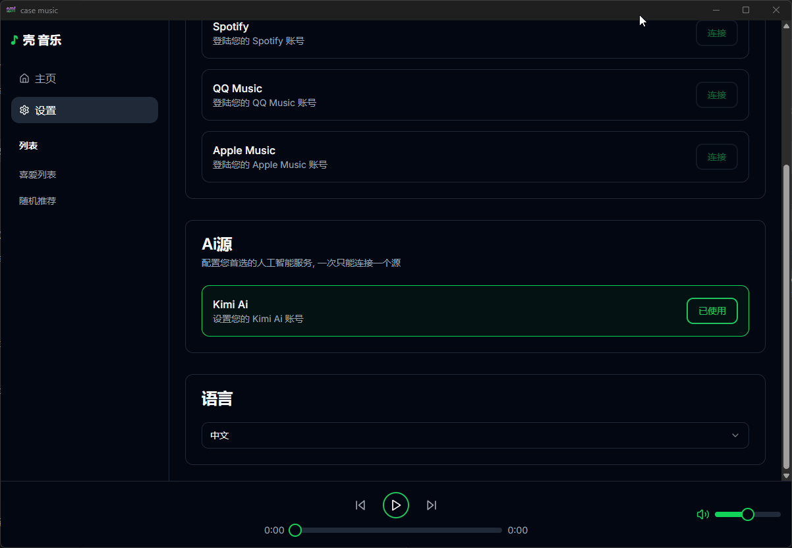
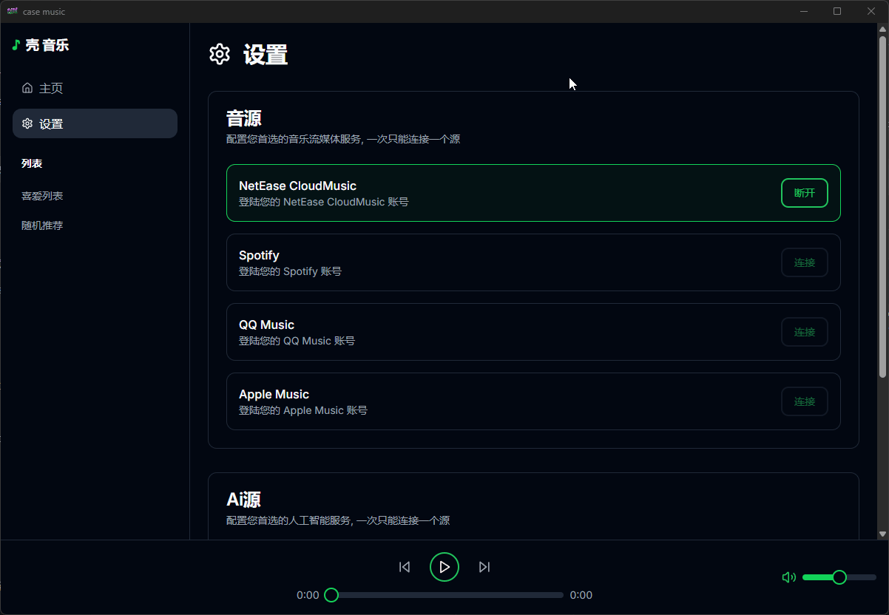
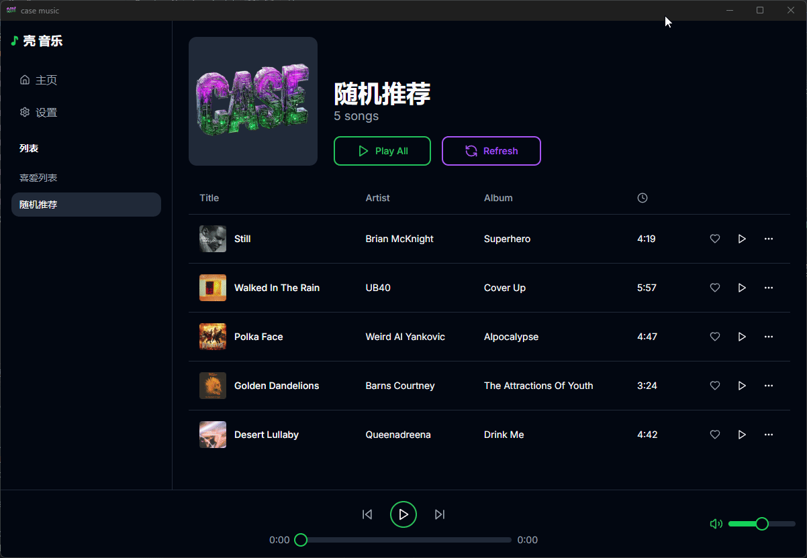
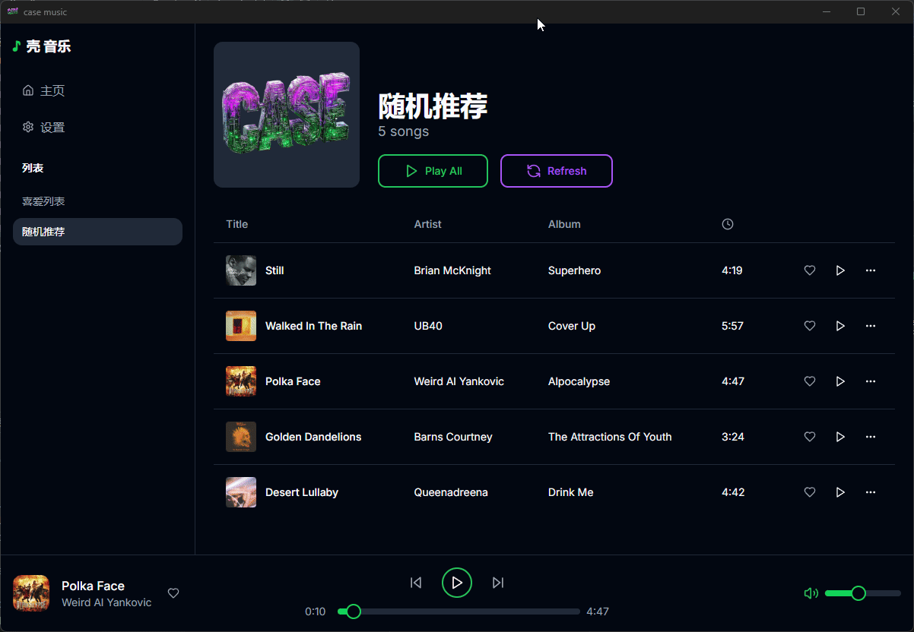
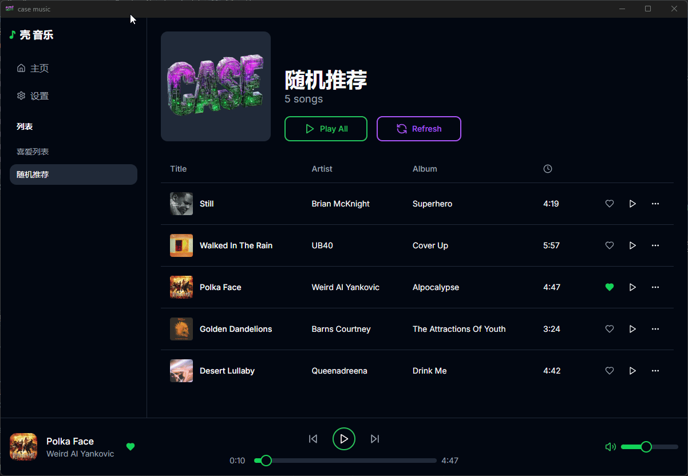

# 壳 音乐

## 介绍

# 🎵 欢迎来到 **壳 音乐** 🎧
# 🎬 **壳 音乐 - AI 音乐体验，未来已来** 🚀

体验由**AI智能推荐**精心打造的个性化音乐发现未来。

### 🤔 **你是否有过这样的感受？**
- **选择困难症:** 每天不知道听什么？
- **推荐不准确:** 每日推荐总是差点意思？
- **推荐太有限:** 每天只有一次推荐，远远不够？
- **缺少心动:** 好久没有心动地点亮一首歌？
- **还有更多...**

如果以上困扰你，那么 **壳 音乐** 将彻底改变你的音乐体验。

### 🚀 **为什么选择 壳 音乐？**
- **智能AI推荐:** 为你量身定制的播放列表，符合你的心情和品味。
- **持续发现新曲:** 每时每刻都能获得新鲜音乐推荐。
- **用户至上设计:** 你的偏好驱动我们的推荐引擎。

🎧 **告别音乐烦恼，享受轻松发现的乐趣。** 尝试 壳 音乐，让音乐尽情播放！

### PC 版本

### 🎵 **音乐源集成**
*无缝连接你的音乐来源，解锁无限曲库。*  
  

### 🤖 **AI智能登录 - 更智能的访问体验**
*借助AI技术，轻松连接，享受智能体验。*  
  

### 🌐 **多语言支持**
*轻松切换语言，感受熟悉的操作体验。*  

### ⚙️ **流畅的设置体验**
*轻松调整设置，享受个性化体验。*  

### ❤️ **探索你的喜欢列表**
*轻松访问你收藏的“喜欢的歌曲”列表。*  

### 🔀 **随机推荐 - 给你惊喜**
*想要新鲜感？让AI为你随机推荐一首歌。*  

### 🎼 **一键播放 - 即刻沉浸**
*一键播放，享受无尽的音乐律动。*  

### 🔄 **刷新列表，发现新曲**
*新的氛围，新的心情，一键刷新，发现更多。*  
.gif)

### 🎧 **爱上一首歌**
*点击喜欢，将心仪的歌曲永久珍藏。*  

### 💔 **轻松取消喜欢**
*改变主意了？轻松取消收藏。*  
  
